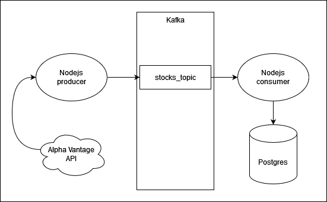

# Data Streaming and Visualization Example

#### Note
If you encounter any problems starting this example I encourage you to create an issue. This helps improve this small project and also makes it better for everyone to use and learn from it :)

Just for reference my setup is an Ubuntu 22.04.3 LTS

## TL;TR
This GitHub repository hosts a university assignment demonstrating a simple implementation of data streaming and visualization. It includes steps for fetching data from an external API, streaming it through Kafka, storing it in a PostgreSQL database, and visualizing it with Grafana.

## Prerequisites
  + docker
  + docker-compose

## RUN
To launch the setup, execute:
```{bash}
docker-compose up -d
```

After the containers have started the Grafana dashboard should be avalible at http://localhost:3000

## Technologies Used
- **Grafana**: For creating interactive visualizations of the stored data.
- **Prometheus**: Employed for storing postgreSQL metrics.
- **Apache Kafka**: Utilized for data streaming, including Kafka brokers and custom Kafka producers and consumers.
- **PostgreSQL**: Serves as the database for storing the fetched data.

## Data Source
The data is sourced from the [Alpha Vantage API](https://www.alphavantage.co/documentation/), providing a range of financial datasets. If you don't have an API key set the environemnt variable 'DEV' on the NodeJS producer and it will simulate fetching data from the API by reading the data.json file which is located in the node folder. JFYI. the API is completely free but you have to create an account.

## Docker Compose Setup
The project is containerized using Docker Compose, defining services for Grafana, Prometheus, Kafka components (brokers and producers, consumers setup in NodeJS) and PostgreSQL. This setup ensures an isolated and consistent environment for each component of the data pipeline.

# Important Note: Non-Production Environment!

Please be aware that this setup is designed for educational and demonstration purposes only. It is not configured for a production environment. 

## Infrastructure



## Contributions
Contributions are welcome to enhance the functionality or documentation of this project.

---
