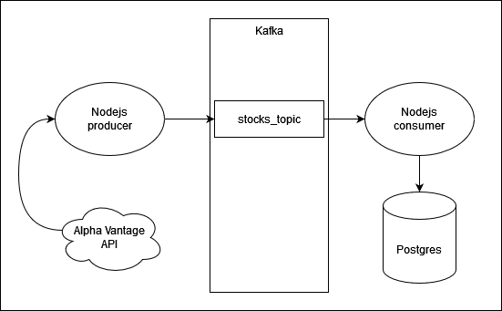

# dsi_exercise06 - Data Streaming and Visualization Example

## Overview
This GitHub repository hosts a university assignment demonstrating a simple implementation of data streaming and visualization. It includes steps for fetching data from an external API, streaming it through Kafka, storing it in a PostgreSQL database, and visualizing it with Grafana.

## Prerequisites
  + docker
  + docker-compose

## Technologies Used
- **Grafana**: For creating interactive visualizations of the stored data.
- **Prometheus**: Employed for monitoring the system's performance.
- **Apache Kafka**: Utilized for data streaming, including Kafka brokers and custom Kafka producers and consumers.
- **PostgreSQL**: Serves as the database for storing the fetched data.

## Data Source
The data is sourced from the [Alpha Vantage API](https://www.alphavantage.co/documentation/), providing a range of financial datasets. If you don't have an API key set the environemnt variable 'DEV' on the NodeJS producer and it will simulate fetching data from the API by reading the data.json file which is located in the node folder.

## Docker Compose Setup
The project is containerized using Docker Compose, defining services for Grafana, Prometheus, Kafka components (brokers, producers, and consumers), and PostgreSQL. This setup ensures an isolated and consistent environment for each component of the data pipeline.

# Important Note: Non-Production Environment!

Please be aware that this setup is designed for educational and demonstration purposes only. It is not configured for a production environment. 

## Infrastructure




## RUN
To launch the setup, execute:
```{bash}
docker-compose up -d
```

## Contributions
Contributions are welcome to enhance the functionality or documentation of this project.

---
